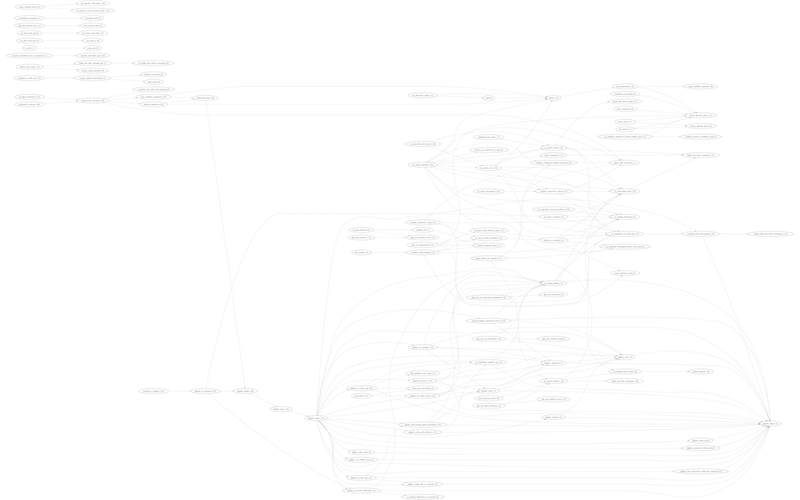

# fixer-prio-graph
Build a priority graph for [PHP-CS-Fixer](https://github.com/FriendsOfPHP/PHP-CS-Fixer)'s fixers.

## The Graph
(Click for full-size image)
[](graphs/da6e53e676.png?raw=true)

## Explanation
PHP-CS-Fixer has rules, implemented as _fixers_. Those fixers (can) have a priority, to determine which fixer has to run
before or after certain other fixers. Each defined priority-relation is shown here, as
```
( rule_alpha (priority) )--->( rule_beta (priority) )--->( rule_gamma (priority) )
```
meaning that rule alpha has to run before rule beta which in turn has to run before rule gamma, which is enforced by the
fact that alpha's priority is bigger than beta's which in turn is bigger than gamma's.

## Usage
First make sure to have the latest PHP-CS-Fixer master, and then run the script. As single command:
```
composer update && php fixer-prio-graph.php
```
The script will open the newly created graph in the image viewer defined by your OS.

## Installation
Just `git clone` the repo.

It depends on [Graphviz](http://www.graphviz.org/) to generate the image, for installation see
[their download page](https://graphviz.gitlab.io/download/).

(Hint for mac: `brew install graphviz`)

## License
MIT License

Copyright (c) 2018 Dave van der Brugge
